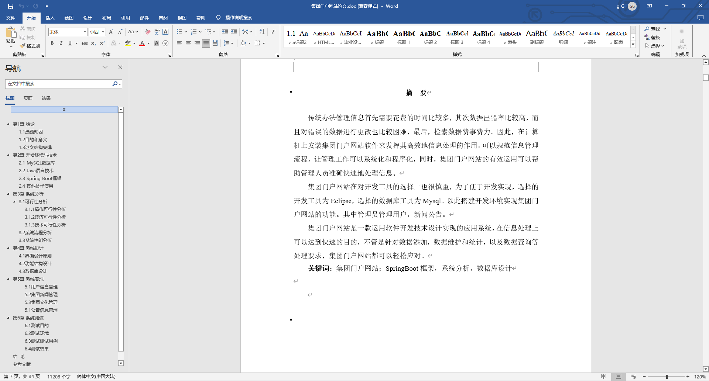

基于Springboot的集团门户网站（程序+论文）
=
### 完整代码获取地址：从戎源码网 ([https://armycodes.com/](https://armycodes.com/))
### 作者微信：19941326836  QQ：952045282 
### 承接计算机毕业设计、Java毕业设计、Python毕业设计、深度学习、机器学习
### 选题+开题报告+任务书+程序定制+安装调试+论文+答辩ppt 一条龙服务
### 所有选题地址https://github.com/nature924/allProject

一、项目介绍
---
基于Spring Boot框架实现的集团门户网站，系统包含两种角色：管理员、用户主要功能如下。
### 【用户功能】

1. **首页：** 浏览集团门户网站的主要信息。
2. **论坛：** 参与用户间的交流和讨论。
3. **集团文化：** 了解和学习集团的文化理念和价值观。
4. **公告通知：** 获取集团发布的重要通知和公告。
5. **集团简介：** 阅读关于集团的简要介绍和发展历程。
6. **核心竞争力：** 掌握集团的核心竞争力和特色。
7. **集团新闻：** 查看集团的最新新闻和活动报道。
8. **个人中心：** 管理个人信息。

### 【管理员功能】

1. **首页：** 查看集团门户网站的整体概况。
2. **个人中心：** 修改密码、管理个人信息。
3. **管理员管理：** 审核和管理注册管理员用户的信息。
4. **基础数据管理：** 管理网站的基础数据。
5. **论坛管理：** 管理用户间的讨论和交流，包括删除不当内容。
6. **集团文化管理：** 发布、编辑和删除集团文化信息，管理留言和收藏。
7. **公告通知管理：** 发布、编辑和删除公告通知。
8. **单页数据管理：** 管理单页数据的内容和展示。
9. **集团新闻管理：** 发布、编辑和删除集团新闻。
10. **用户管理：** 审核和管理注册用户的信息。
11. **轮播图信息：** 管理网站首页的轮播图。

二、项目技术
---
- 编程语言：Java
- 数据库：MySQL
- 项目管理工具：Maven
- 前端技术：VUE、HTML、Jquery、Bootstrap
- 后端技术：Spring、SpringMVC、MyBatis

三、运行环境
---
- 操作系统：Windows、macOS都可以
- JDK版本：JDK1.8以上都可以
- 开发工具：IDEA、Ecplise、Myecplise都可以
- 数据库: MySQL5.7以上都可以
- Tomcat：任意版本都可以
- Maven：任意版本都可以

四、运行截图
---
### 论文截图：

### 程序截图：

